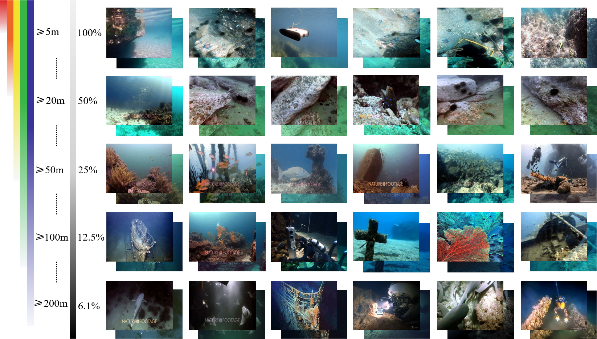
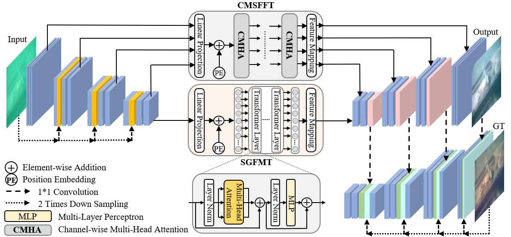
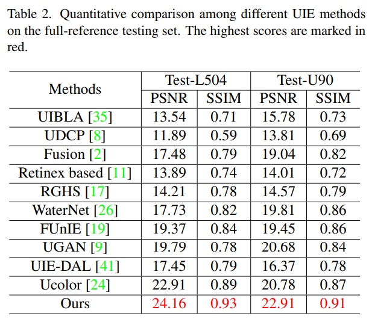
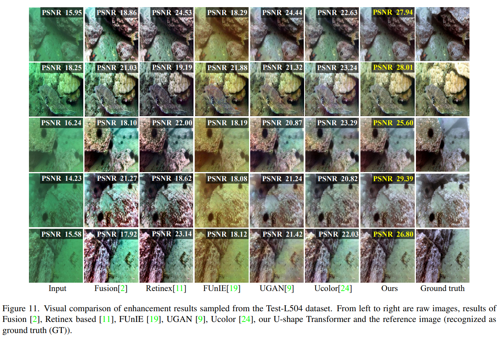
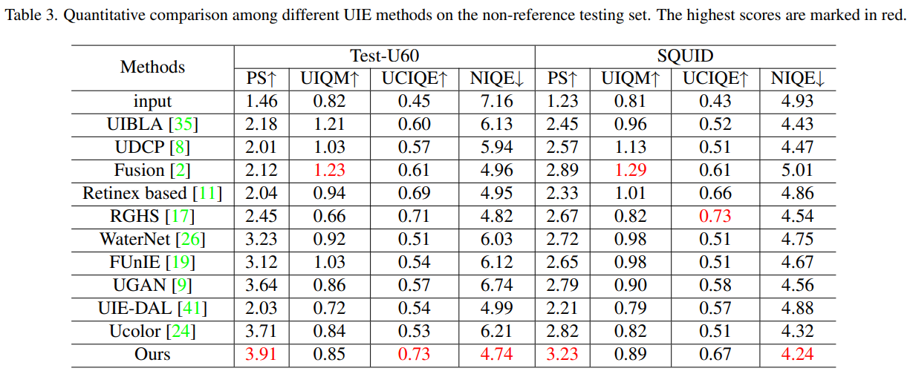
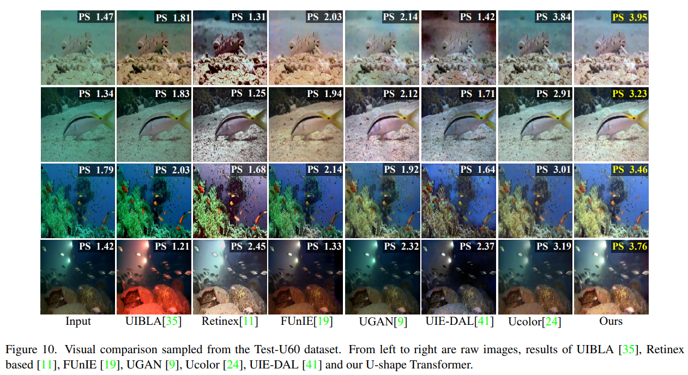

# U-shape Transformer 

[](https://arxiv.org/abs/2111.11843)


This repository is the official PyTorch implementation of U-shape Transformer  for Underwater Image Enhancement. ([arxiv](https://arxiv.org/abs/2111.11843), [Dataset](https://pan.baidu.com/s/1dqB_k6agorQBVVqCda0vjA)(lsui), [video demo](https://lintaopeng.github.io/_pages/UIE%20Project%20Page.html), [visual results](https://lintaopeng.github.io/_pages/UIE%20Project%20Page.html)). U-shape Transformer achieves **state-of-the-art performance** in underwater image enhancement task.

</br>


:rocket:  :rocket:  :rocket: **News**:


- 2021/11/25 We released our pretrained model, You can download the pretrain models in [BaiduYun](https://pan.baidu.com/s/1nxmlu_Qs8YNz0NqshNS_ZA) with the password tdg9 or in [Google Drive](https://drive.google.com/file/d/19a_kDJTT5S96kzwQntEMhSxAPYw4xY2P/view?usp=sharing
).  

- 2021/11/24  We released the official code of U-shape Transformer

- 2021/11/23  We released LSUI dataset, We released a large-scale underwater image (LSUI) dataset, which involves richer underwater scenes (lighting conditions, water types and target categories) and better visual quality reference images than the existing ones. You can download it from [[here\]](https://pan.baidu.com/s/1dqB_k6agorQBVVqCda0vjA)(lsui) or [GoogleDrive](https://drive.google.com/file/d/10gD4s12uJxCHcuFdX9Khkv37zzBwNFbL/view?usp=sharing).

  

---

> The light absorption and scattering of underwater impurities lead to poor underwater imaging quality. The existing data-driven based underwater image enhancement (UIE) techniques suffer from the lack of a large-scale dataset containing various underwater scenes and high-fidelity reference images. Besides, the inconsistent attenuation in different color channels and space areas is not fully considered for boosted enhancement. In this work, we constructed a large-scale underwater image (LSUI) dataset
> , and reported an U-shape Transformer network where the transformer model is for the first time introduced to the UIE task. The U-shape Transformer is integrated with a channel-wise multi-scale feature fusion transformer (CMSFFT) module and a spatial-wise global feature modeling transformer (SGFMT) module, which reinforce the network's attention to the color channels and space areas with more serious attenuation. Meanwhile, in order to further improve the contrast and saturation, a novel loss function combining RGB, LAB and LCH color spaces is designed following the human vision principle. The extensive experiments on available datasets validate the state-of-the-art performance of the reported technique with more than 2dB superiority.
> 
><p align="center">
  
</p>

#### Contents

1. [Training](#Training)
1. [Testing](#Testing)
1. [Results](#Results)
1. [Citation](#Citation)
1. [License and Acknowledgement](#License-and-Acknowledgement)


### Training

If you need to train our U-shape transformer from scratch, you need to download our dataset from [BaiduYun](https://pan.baidu.com/s/1dqB_k6agorQBVVqCda0vjA)(password is lsui) or [GoogleDrive](https://drive.google.com/file/d/10gD4s12uJxCHcuFdX9Khkv37zzBwNFbL/view?usp=sharing), and then randomly select 3879 picture pairs as the training set to replace the data folder, and the remaining 400 as the test set to replace the test folder. The dataset divided by the author can be downloaded from [BaiduYun](https://pan.baidu.com/s/1xjc8hHc6IkUwg3cuPTogxg )(password is lsui).

Then, run the `train.ipynb` file with Jupiter notebook, and the trained model weight file will be automatically saved in saved_ Models folder. As described in the paper, we recommend you use L2 loss for the first 600 epochs and L1 loss for the last 200 epochs.

Environmental requirements:

- Python 3.7 or a newer version

- Pytorch 1.7 0r a newer version

- CUDA 10.1 or a newer version

- OpenCV 4.5.3 or a newer version

- Jupyter Notebook

Or you can install from the requirements.txt using
```angular2html
pip install -r requirements.txt
```

## Testing
For your convenience, we provide some example datasets (~20Mb) in `./test`.  You can download the pretrain models in [BaiduYun](https://pan.baidu.com/s/1nxmlu_Qs8YNz0NqshNS_ZA) with the password tdg9 or in [Google Drive](https://drive.google.com/file/d/19a_kDJTT5S96kzwQntEMhSxAPYw4xY2P/view?usp=sharing
). 

After downloading, extract the pretrained model into the project folder and replace the `./saved_models` folder, and then run `test.ipynb`. The code will use the pretrained model to automatically process all the images in the `./test/input` folder and output the results to the `./test/output` folder. In addition, the output result will automatically calculate the PSNR value with the reference image.

## Dataset
The LSUI is a large-scale underwater image (LSUI) dataset, which involves richer underwater scenes (lighting conditions, water types and target categories) and better visual quality reference images than the existing ones. You can download it from [BaiduYun](https://pan.baidu.com/s/1dqB_k6agorQBVVqCda0vjA)(password is lsui) or [GoogleDrive](https://drive.google.com/file/d/10gD4s12uJxCHcuFdX9Khkv37zzBwNFbL/view?usp=sharing). If you want to use the LSUI dataset, please cite our [[paper\]](https://ieeexplore.ieee.org/abstract/document/10129222)


## Results
We achieved state-of-the-art performance on underwater image enhancement task. Detailed results can be found in the [paper](https://arxiv.org/abs/2111.11843) or our [project page](https://lintaopeng.github.io/_pages/UIE%20Project%20Page.html)


<details>
<summary>Full-Reference Evaluation (click me)</summary>
<p align="center">
  
  
</p>
</details>

<details>
<summary>Non-reference Evaluation </summary>
<p align="center">
  
  
</p>
</details>


## Citation
    @ARTICLE{10129222,
      author={Peng, Lintao and Zhu, Chunli and Bian, Liheng},
      journal={IEEE Transactions on Image Processing}, 
      title={U-Shape Transformer for Underwater Image Enhancement}, 
      year={2023},
      volume={32},
      number={},
      pages={3066-3079},
      doi={10.1109/TIP.2023.3276332}}


## License and Acknowledgement
This project is released under the MIT license. The codes are designed based on [pix2pix](https://github.com/eriklindernoren/PyTorch-GAN). We also refer to codes in [UCTransNet](https://github.com/McGregorWwww/UCTransNet) and [TransBTS](https://github.com/Wenxuan-1119/TransBTS). Please also follow their licenses. Thanks for their awesome works.


